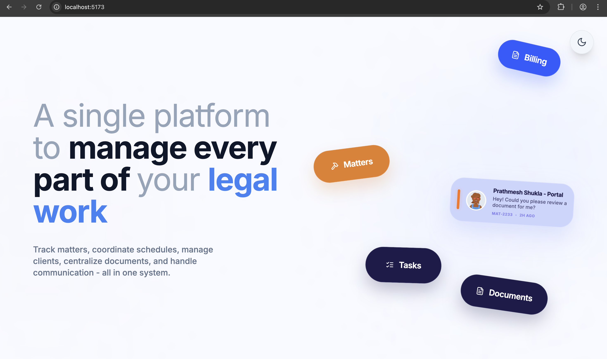
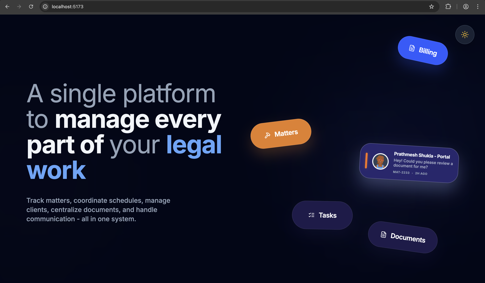

# Praava Legal Assessment - Prathmesh Shukla

Hey! This is my implementation for the Legal Work Platform hero section assignment. I’ve focused on getting the UI to look "pixel-perfect" while keeping the code clean and the interactions smooth.

Live Link : https://praava-intern-assignment.vercel.app/

## My Approach for this Assignment

When I first saw the design, I knew the challenge would be balancing the "organized chaos" of the floating cards with a strict layout that doesn't feel cluttered on smaller screens. Here’s how I tackled it:

### 1. Nailing the Typography
The design relies heavily on font weight and color to create a hierarchy. I noticed that just using standard line breaks made the H1 feel a bit fragmented on some screens. I spent some time tweaking the `max-width` and word-wrapping in `HeroSection.jsx` so the text flows naturally, making sure "legal work" always stands out as the primary focus.

### 2. Creating the "Floating" Feel
For the cards (Billing, Matters, Tasks, etc.), I didn't want them to just sit there. I used **Framer Motion** to add a subtle Y-axis loop. It’s barely noticeable at first, but it makes the whole section feel alive. Each card is positioned absolutely using arbitrary Tailwind values (like `rotate-[12deg]`) to match the reference image's composition exactly.

### 3. The 100vh Constraint
One thing I noticed was that even minor padding or border-boxes could introduce a slight vertical scroll. Since a hero section like this should ideally be a "single-page" experience, I went back and forced a strict `h-screen` and `overflow-hidden` across the whole wrapper. This ensures it looks solid and contained on everything from my laptop to a mobile device.

### 4. Special "Portal" Card
I built a dedicated `PortalCard` component for the "Prathmesh Shukla - Portal" item. I made sure to include those little details like the orange accent bar and the message timestamp, as they really add to the "premium" feel of the UI.

## Local Setup

If you want to run this locally, it's pretty standard:

1.  `npm install` to grab the dependencies (Tailwind, Framer Motion, Lucide).
2.  `npm run dev` to fire up the Vite server.
3.  Check it out at `localhost:5173`.

Everything is responsive and supports dark mode out of the box!

---
*Built with React, Tailwind CSS, and Framer Motion.*
